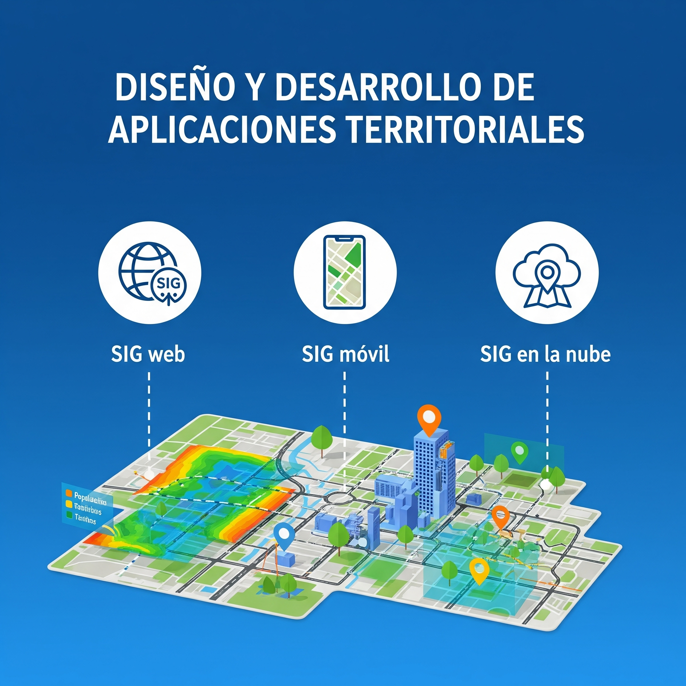

<div style="text-align: center;">
  
</div>

<div style="text-align: center;">
  <h1>Diseño y Desarrollo de Aplicaciones Territoriales (DyDAT)</h1>
  <p>
    <strong>Universidad de Santiago de Chile</strong><br>
    <strong>Facultad de Ingeniería</strong><br>
    <strong>Departamento de Ingeniería Geoespacial y Ambiental</strong><br>
    <em>2do Semestre 2025</em>
  </p>
</div>

---

### 📋 Índice de Contenidos

1.  [Bienvenida](#-bienvenida)
2.  [Capacidades que adquirirán en el curso](#-capacidades-que-adquirirán-en-el-curso)
3.  [Contenido del Curso](#-contenido-del-curso)
    * [Cátedra](#cátedra)
    * [Laboratorio](#laboratorio)
4.  [Cómo Clonar este Repositorio](#-cómo-clonar-este-repositorio)
    * [Requisitos](#requisitos)
    * [Pasos para la Clonación](#pasos-para-la-clonación)
5.  [Acerca del Profesor: Ignacio Yáñez Henríquez](#-acerca-del-profesor-ignacio-yáñez-henríquez)

---

## 👋 Bienvenida

<div style="text-align: justify;">
Bienvenidas y bienvenidos al curso de Diseño y Desarrollo de Aplicaciones Territoriales. Esta asignatura busca entregar al Ingeniero Civil en Geografía las herramientas y metodologías de gestión de proyectos geoinformáticos necesarios para la construcción de aplicaciones basadas en Sistemas de Información Geográfica (SIG), con el objetivo de generar productos de información que apoyen la toma de decisiones sobre el territorio.
</div>
<br>
<div style="text-align: center;">
  
</div>

---

## 💡 Capacidades que adquirirán en el curso

Al finalizar la asignatura, serás capaz de aplicar fundamentos teóricos y prácticos en diversas áreas clave de la geoinformática, incluyendo:

* **Programación:** Escritura de código para automatizar tareas y crear soluciones geoespaciales.
* **Sistemas de Información Geográfica (SIG):** Manejo avanzado de herramientas para el análisis y visualización de datos territoriales.
* **Bases de Datos Espaciales:** Diseño y gestión de bases de datos optimizadas para almacenar información geográfica.
* **Desarrollo Web, Móvil y de Escritorio:** Creación de aplicaciones SIG para diferentes plataformas (visores de mapas, apps de campo, software de análisis).
* **Computación en la Nube (Cloud Computing):** Implementación de soluciones geoespaciales en plataformas en la nube para mejorar la escalabilidad y el acceso.
* **Metodologías de Desarrollo:** Aplicación de flujos de trabajo ágiles y eficientes para la gestión de proyectos de software geoinformático.

---

## 📚 Contenido del Curso

Aquí encontrarás todos los materiales necesarios para la cátedra y el laboratorio.

### **Cátedra**
* 📄 [Recursos y Apuntes de Cátedra](Cátedra/Recursos)

### **Laboratorio**
* 👨‍💻 [Guías y Material de Laboratorio](Laboratorio/Apuntes)

---

## 🚀 Cómo Clonar este Repositorio

Para tener una copia local de todos los materiales del curso en tu computador, sigue estos sencillos pasos.

### Requisitos

* Tener [Git](https://git-scm.com/downloads) instalado. Puedes verificar si lo tienes abriendo una terminal y escribiendo `git --version`.

### Pasos para la Clonación

1.  **Abre una terminal** (Terminal cmd, PowerShell, o Git Bash).

2.  **Elige una ubicación** en tu computador donde quieras guardar los archivos del curso. Por ejemplo, el Escritorio o tu carpeta de Documentos.
    ```bash
    # Ejemplo: para ir a la carpeta de Documentos
    cd Documentos
    ```

3.  **Clona el repositorio** usando el siguiente comando (se recomienda HTTPS por ser más sencillo):

    * **Opción 1 (HTTPS):**
        ```bash
        git clone [https://github.com/iyanezUSACH/DyDAT_2s_2025.git](https://github.com/iyanezUSACH/DyDAT_2s_2025.git)
        ```

    * **Opción 2 (SSH, para usuarios avanzados):**
        ```bash
        git clone git@github.com:iyanezUSACH/DyDAT_2s_2025.git
        ```

4.  **Ingresa a la carpeta** que acabas de crear:
    ```bash
    cd DyDAT_2s_2025
    ```

✅ ¡Listo! Ahora tienes todos los archivos del curso en tu computador. Para actualizarlos más adelante, solo necesitarás navegar a esta carpeta y ejecutar el comando `git pull`.

---

## 👨‍🏫 **Acerca del Profesor: Ignacio Yáñez Henríquez**

<div align="center">

</div>

<div style="text-align: justify;">
¡Bienvenidas y bienvenidos! Soy **Ignacio Yáñez Henríquez**, y seré su profesor en este viaje por el Diseño y Desarrollo de Aplicaciones Territoriales. Al igual que ustedes, soy **Ingeniero Civil en Geografía, titulado de esta misma casa de estudios, la Universidad de Santiago de Chile** 🎓.

Mi carrera profesional de **más de 15 años** 💼 se ha centrado en conectar el análisis espacial con soluciones tecnológicas de alto impacto. He tenido la oportunidad de liderar y gestionar proyectos SIG en entornos tan desafiantes como la gran minería, trabajando para **Codelco en la División El Teniente** ⛏️, y más recientemente, como **Mining Industry Manager en Esri Chile S.A.**, la empresa líder a nivel mundial en tecnología geoespacial 🗺️.

Esta trayectoria me ha permitido no solo administrar y operar arquitecturas de datos geoespaciales complejas, sino también estar en la primera línea del desarrollo de aplicaciones 📱. Mi experiencia abarca desde plataformas consolidadas como **ArcGIS Enterprise, Pro y Online**, hasta la creación de soluciones específicas con **Experience Builder, Dashboards y aplicaciones móviles como FieldMaps y Survey123**.

Para mantenerme a la vanguardia, complementé mi formación con un **Máster en Big Data y Data Science** 📊, lo que me ha permitido incorporar en mi trabajo un sólido dominio de **Python (con librerías de Machine Learning y ArcPy)** 🐍, bases de datos **SQL y NoSQL**, y herramientas de visualización como **Power BI y Tableau**.

Mi objetivo en este curso 🎯, que he tenido el honor de impartir en diferentes formatos en la USACH desde 2013, es claro: entregarles las herramientas y metodologías que la industria demanda hoy. No solo aprenderán la teoría, sino que construiremos aplicaciones prácticas 🛠️, preparándolos para enfrentar los desafíos de la transformación digital en la gestión de nuestro territorio.
</div>

**🔗 Contacto y Redes Profesionales:**
* **LinkedIn:** [Ignacio Yáñez Henríquez](https://www.linkedin.com/in/ignacio-ya%C3%B1ez-henriquez/)
* **Correo Institucional:** [ignacio.yanez.h@usach.cl](mailto:ignacio.yanez.h@usach.cl)
